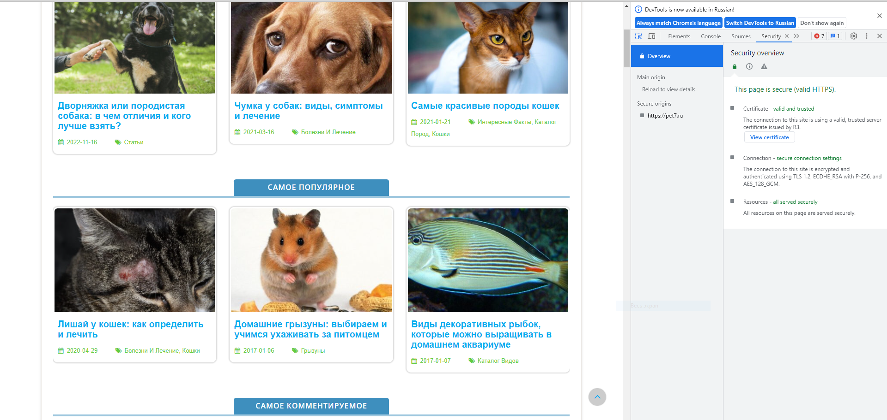
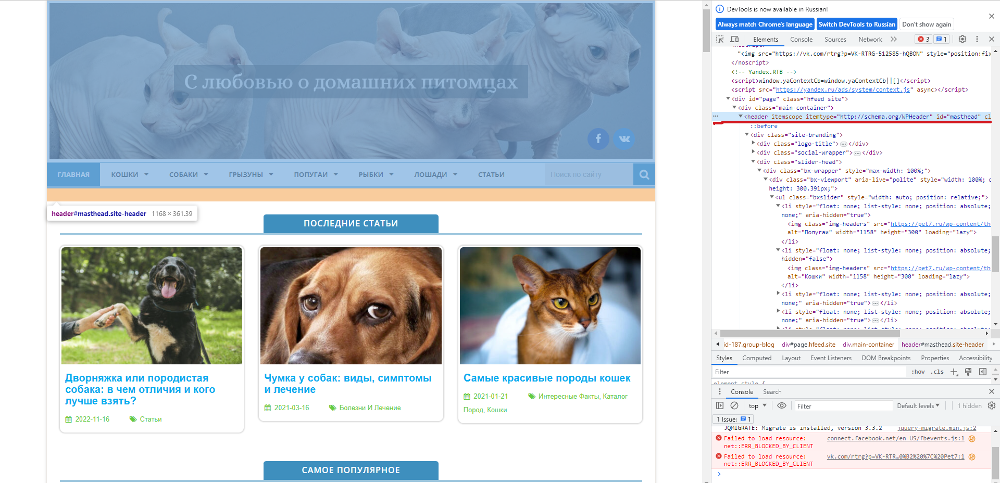
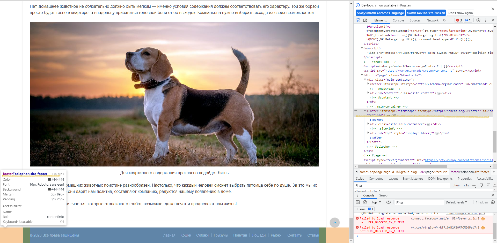
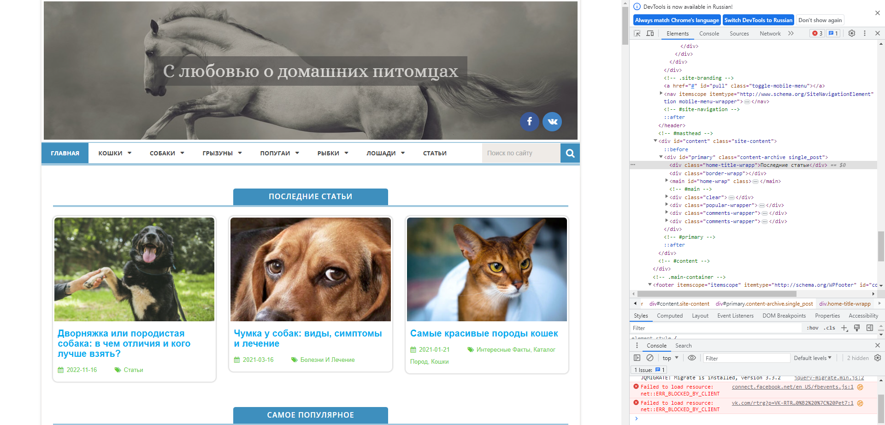
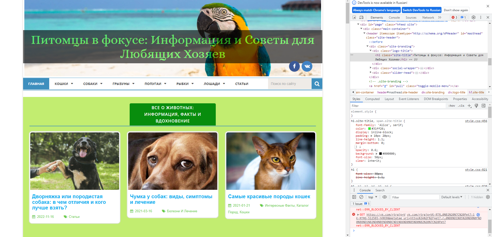
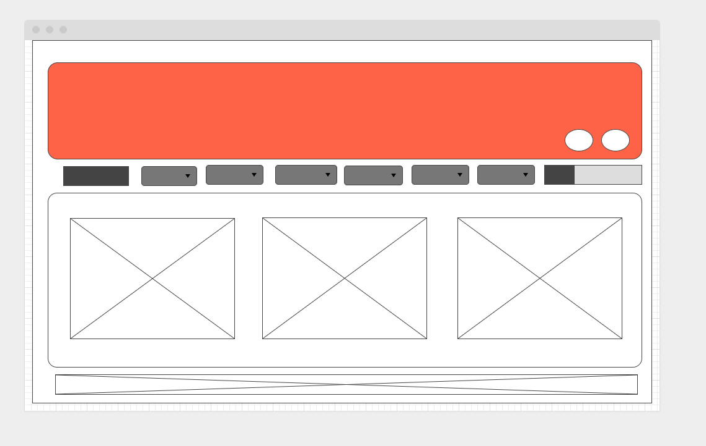

# Урок 1. Веб-технологии: вчера, сегодня, завтра **

*Задача* на основе сайта https://pet7.ru/
- Определите, на каком протоколе работает сайт.
- Проанализируйте структуру страницы сайта.
- Внесите не менее 3 изменений на страницу с помощью инструмента разработчика и представьте скриншоты было/стало.
- Создайте прототип низкой детализации.

Сдайте в виде zip-архива со скриншотами результатов, назовите файл по смыслу работы. ИЛИ можете использовать сервис https://www.notion.so/ или в идеале гит.

## Решение
**1. Определите, на каком протоколе работает сайт**

**2. Проанализируйте структуру страницы сайта.**

Header

Footer

**3. Внесите не менее 3 изменений на страницу с помощью инструмента разработчика и представьте скриншоты было/стало.**
Было

Стало

**4. Создайте прототип низкой детализации.**
